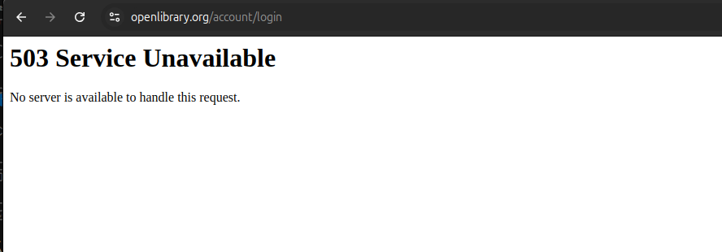
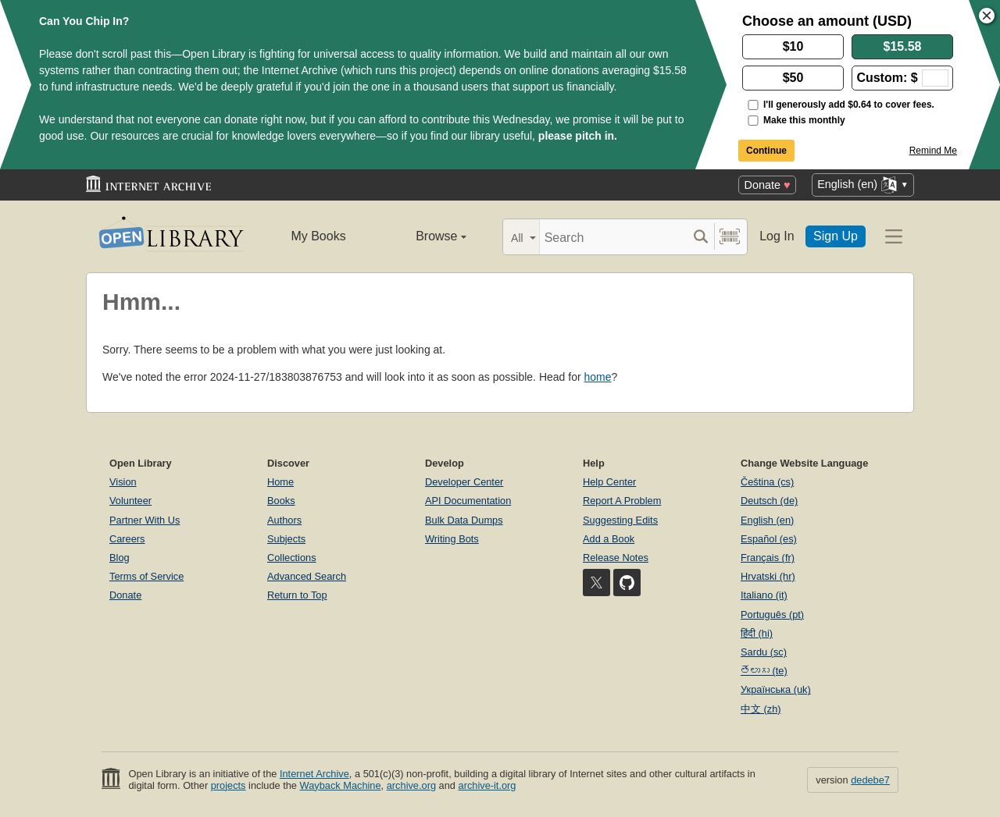

# ThreatFabric-test-assignment

## Introduction

The Playwright framework has been selected to provide test coverage for openlibrary.
Playwright supports both UI and API testing. It is outstanding compared to competitors.
More information about Playwright can be found [here](https://playwright.dev/docs/intro).

Alternatives which were not used:

- Cypress - does have several architectural limitations: Inability to instantiate multiple browsers and/or multiple domains. Does not have out of the box iFrame support.

- Selenium - is only a UI testing library.

## Requirements

- `NodeJS 20+` - can be downloaded from [here](https://nodejs.org/en/download/package-manager)

## Setup Project

1. Clone the repository:

   ```sh
   git clone git@github.com:sirdir/ThreatFabric-test-assignment.git
   ```

2. Navigate to the project directory:

   ```sh
   cd ThreatFabric-test-assignment
   ```

3. Install project dependencies:

   ```sh
   npm install
   ```

4. Install playwright required dependencies (will ask for `sudo`):

   ```sh
   npx playwright install --with-deps chromium
   ```

5. Update `.env` file with valid variables (have been send with corresponding email).

## Solutions and Choices:

### In general

- `test.steps()` were used to make tests more readable.

- One test was marked with the annotation test.fail() because the API is not implemented according to the documentation. More information about this annotation can be found [here](https://playwright.dev/docs/api/class-test#test-fail)..

- Separate `fixtures` for API and UI testing.

### UI

Page Object has been used for UI tests. As well, due to the repetitiveness of some elements on the page, specific components were created to reduce code duplication.

UI tests have been configured to run only for Chrome. They can be easily extended to other browsers.

### API

Main functionality is stored in the controller classes. Like in this case `lists-controller.ts`, functions represent the APIs like `createList()`.

Every function in the controller does a few things:

- Performs API call and returns the obtained response.
- Checks the response for status code. By default, the expected status is set to 200, but it can be passed as an argument.
- If the response has a body, it will be parsed as JSON.

## Test cases:

Apart from tests that were explicitly stated in the test assignment, I have added one test suite for UI and one for API. My motivation was dictated by my love for lists, so I consider this functionality important.

### UI

Cover user flow of adding a book to the user's "want to read" list and following removal of the same book from the list.

### API

CRUD tests for `/lists` API.

## Usage

To run all the tests, use the following command in the terminal:

```sh
npm run test
```

If you only UI tests, use the following command in the terminal:

```sh
npm run test-ui
```

If you only API tests, use the following command in the terminal:

```sh
npm run test-api
```

## Reporting

After each test run, the test report will be automatically shown. Failed UI tests, if any, should contain screenshots.

You can also manually run the report with the following command:

```sh
npm run report
```

---

For the CI report look at [GitHub Pages](https://sirdir.github.io/ThreatFabric-test-assignment/)

## CI

GitHub Actions have been used as CI.

All CI jobs by -> [link](https://github.com/sirdir/ThreatFabric-test-assignment/actions/workflows/playwright.yml).

Latest CI report -> [GitHub Pages](https://sirdir.github.io/ThreatFabric-test-assignment/)

## Static Analysis and Code Style

To maintain a consistent code style and prevent potential issues, Prettier and ESLint have been utilized as tools. Before each commit, a `pre-commit` hook is triggered to run Prettier and ESLint.

## P.S.

### Bug

Found one bug (typo) in API documentation, left a comment in [code](./tests/api/list.spec.ts#L52)

### Openlibrary instability

I have experienced several issues during my work on a test assignment. So if tests are failing that is for a reason, please see the report.

Here are the issues that I have expericenced:

- Monday, 25 November openlibrary was unavailable for half a day. You were as well avare about it.
- Wednesday, 27 November openlibrary was unstable, see the screenshots.



---


